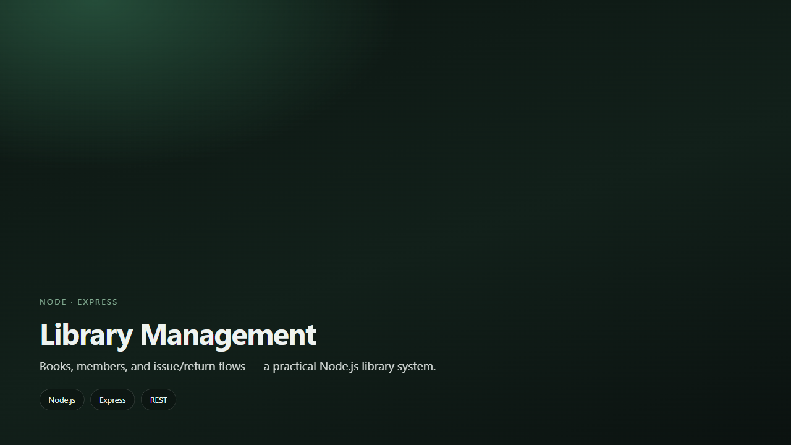

<div align="center">

# Library Management

**Books, members, and issue/return — a practical Node.js library system.**

</div>

<div align="center">
  
</div>

---

## Why this exists

A hands-on Node/Express project for everyday library operations: catalog, members, and borrowing workflows.

---

## What you can do

- Manage books and members
- Issue and return flows
- REST-style controllers and routes
- Local JSON/data layer for practice

---

## Tech stack

| Layer | Technology |
| --- | --- |
| Data | Local data / controllers |
| Backend | Node.js · Express |

---

## Getting started

```bash
git clone https://github.com/Nishanth1409/Library-management.git
cd Library-management
npm install
node server.js
```

Create a `.env` if the project expects one (see existing env examples). Do not commit secrets.

---

## Live & credits

| | |
| :--- | :--- |
| **Author** | [Nishanth K R](https://github.com/Nishanth1409) |
| **Repo** | [Nishanth1409/Library-management](https://github.com/Nishanth1409/Library-management) |
| **Portfolio** | [nkrportfolio.vercel.app](https://nkrportfolio.vercel.app) |

---

<div align="center">

*Son of a farmer · always a farmer.*

[GitHub](https://github.com/Nishanth1409) · [Portfolio](https://nkrportfolio.vercel.app)

</div>
