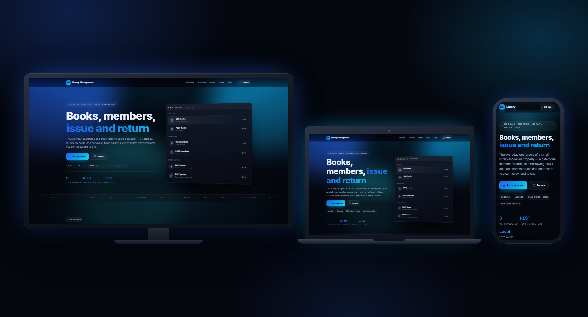
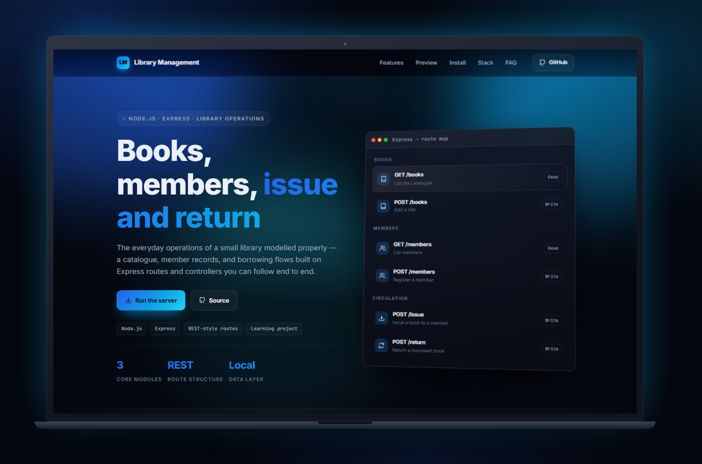
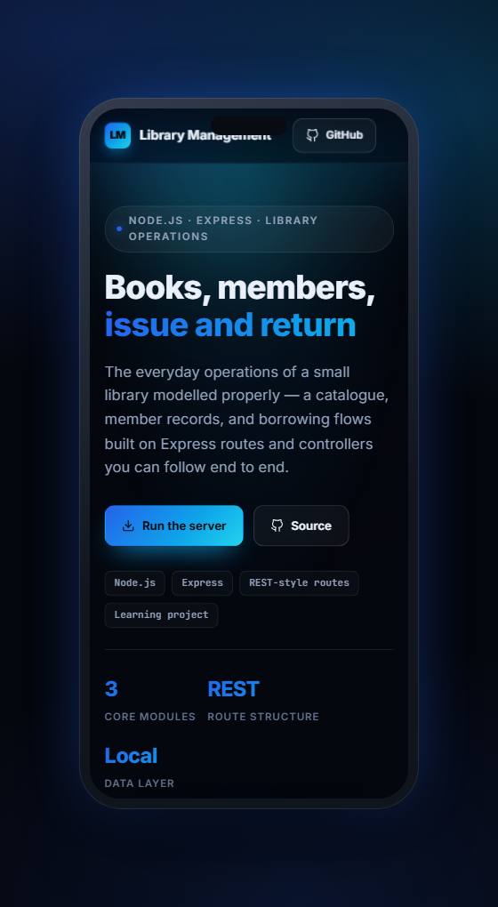
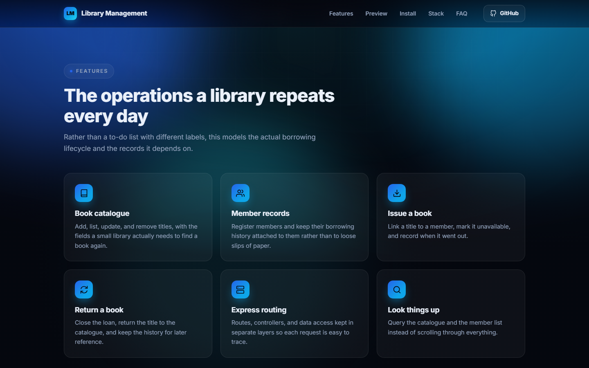
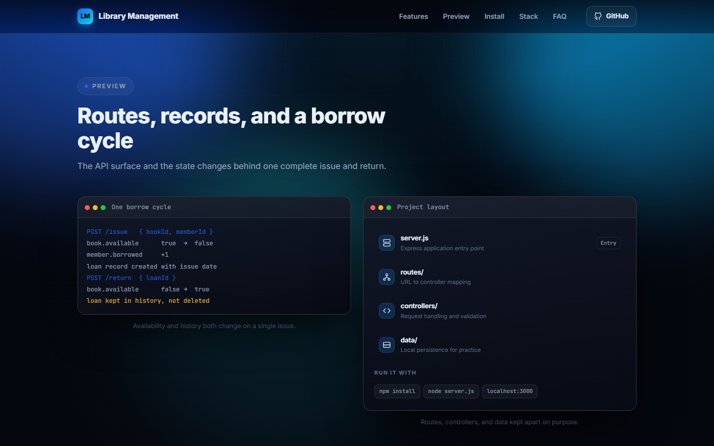
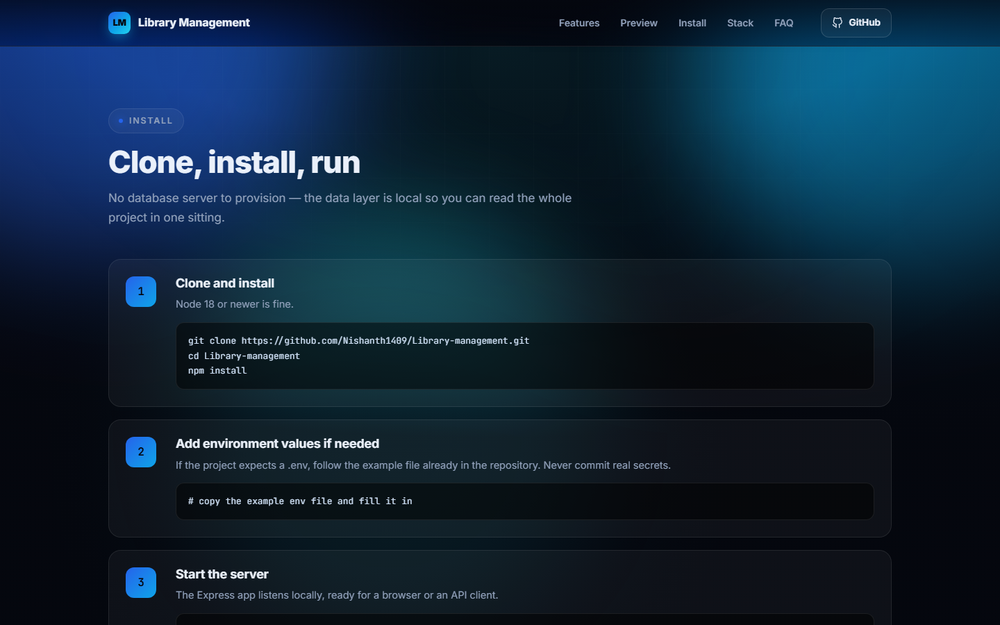

<div align="center">

# Library Management

**A practical Node.js library system** — The everyday operations of a small library modelled properly — a catalogue, member records, and borrowing flows built on Express routes and controllers you can follow end to end.

  

[**Live site →**](https://nishanth1409.github.io/Library-management/)

</div>

<div align="center">
  
  <p><em>One page, three screens — television, laptop, and phone.</em></p>
</div>

---

## Why this exists

A library repeats the same small set of operations forever: catalogue a book, register a member, issue, return. This project models that lifecycle properly on Express, with routes, controllers, and data access kept in separate layers. It is deliberately small, because the value is being able to follow one request from the URL all the way to the state change and back.

> Built by **Nishanth K R** — *son of a farmer, always a farmer.*

---

## What you can do

- **Book catalogue** — Add, list, update, and remove titles, with the fields a small library actually needs to find a book again.
- **Member records** — Register members and keep their borrowing history attached to them rather than to loose slips of paper.
- **Issue a book** — Link a title to a member, mark it unavailable, and record when it went out.
- **Return a book** — Close the loan, return the title to the catalogue, and keep the history for later reference.
- **Express routing** — Routes, controllers, and data access kept in separate layers so each request is easy to trace.
- **Look things up** — Query the catalogue and the member list instead of scrolling through everything.

---

## See it on every screen

| Laptop · 1440 × 900 | Phone · 390 × 844 |
| :---: | :---: |
|  |  |

---

## Every feature, one by one

### The operations a library repeats every day

Rather than a to-do list with different labels, this models the actual borrowing lifecycle and the records it depends on.



### Routes, records, and a borrow cycle

The API surface and the state changes behind one complete issue and return.



### Clone, install, run

No database server to provision — the data layer is local so you can read the whole project in one sitting.



---

## Tech stack

| Layer | Technology |
| --- | --- |
| Runtime | Node.js |
| Framework | Express |
| Structure | Routes, controllers, and a local data layer |
| Interface | REST-style JSON endpoints |

---

## Getting started

### 1. Clone and install

Node 18 or newer is fine.

```bash
git clone https://github.com/Nishanth1409/Library-management.git
cd Library-management
npm install
```

### 2. Add environment values if needed

If the project expects a .env, follow the example file already in the repository. Never commit real secrets.

```bash
# copy the example env file and fill it in
```

### 3. Start the server

The Express app listens locally, ready for a browser or an API client.

```bash
node server.js
```

### 4. Try the borrow cycle

Add a book, register a member, issue the book, then return it, and watch availability flip both ways.

---

## Good to know

<details>
<summary><strong>Is there a hosted demo?</strong></summary>

No. It is a local Node server, so the honest thing is to run it yourself — it takes about a minute.

</details>

<details>
<summary><strong>Why not a full database?</strong></summary>

The point of the project was the request lifecycle and the borrowing rules. A local data layer keeps that visible.

</details>

<details>
<summary><strong>Can I add fines or due dates?</strong></summary>

Yes, and it is a good next exercise — the loan record already has the issue date to build on.

</details>

<details>
<summary><strong>Does it have a front end?</strong></summary>

It is API-first. Any client, or a browser and an API tool, is enough to exercise every route.

</details>

---

## Live & credits

| | |
| :--- | :--- |
| **Live** | [nishanth1409.github.io/Library-management](https://nishanth1409.github.io/Library-management/) |
| **Author** | [Nishanth K R](https://github.com/Nishanth1409) |
| **Repo** | [Nishanth1409/Library-management](https://github.com/Nishanth1409/Library-management) |
| **Portfolio** | [nkrportfolio.vercel.app](https://nkrportfolio.vercel.app) |

---

<div align="center">

*Son of a farmer · always a farmer.*

[GitHub](https://github.com/Nishanth1409) · [Portfolio](https://nkrportfolio.vercel.app)

</div>
